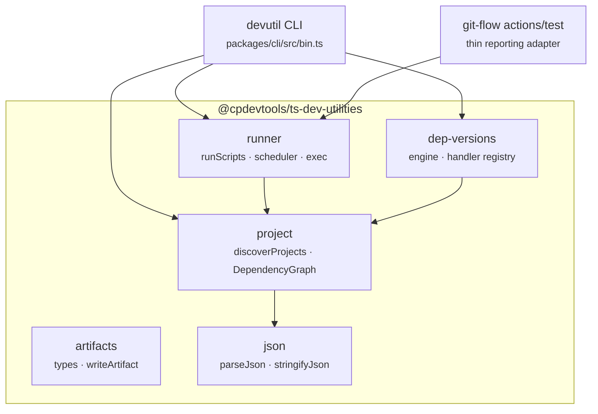

# Architecture

## Repository layout

A two-package pnpm workspace. `packages/*` is the only member glob, so the workspace root itself is
not a project.

```
ts-dev-utilities/
├── packages/
│   ├── ts-dev-utilities/        # @cpdevtools/ts-dev-utilities — the library
│   │   └── src/
│   │       ├── project/         # discovery + dependency graph
│   │       ├── runner/          # parallel scheduler + process exec
│   │       ├── dep-versions/    # cross-ecosystem version pinning
│   │       ├── artifacts/       # artifact descriptor types + writer
│   │       ├── json/            # JSONC parse/stringify
│   │       └── index.ts         # globby + change-case re-exports
│   └── cli/                     # @cpdevtools/ts-dev-utilities-cli — the devutil binary
└── .publish/                    # versions.yml · registries.yml · deps.yml
```

## How the modules fit together



Nothing else in the library depends on `artifacts` or `json`; both exist for consumers. `runner` is
the only module that starts processes.

## Design principles

These are the constraints the code is written to, and they account for most of its structure:

**The engine is not coupled to the release pipeline.** The scheduler works with projects, scripts
and a dependency graph. It has no knowledge of releases, artifacts, tags or GitHub. Anything
GitHub-specific — annotations, step summaries, mode presets — belongs in git-flow's `test` action,
which is a thin adapter over `runScripts`.

**No pass tracking and no change detection.** Every run executes the targeted scripts across the
whole graph. Nothing is stored between runs, so there is no cache to go stale and no shared state
for concurrent runs to conflict over.

**Each project starts independently.** A project runs as soon as its own workspace dependencies
have passed, rather than waiting for every project at the same depth in the graph.
`getTopologicalBatches()` is available for consumers that do want fixed batches; the scheduler does
not use it.

**Few dependencies.** Process execution uses `node:child_process` directly, and concurrency is
handled by the scheduler's own loop rather than a library such as `p-limit`. The CLI uses a small
argument parser rather than a framework such as oclif, to keep the install light.

**The library comes first and the CLI second.** Every CLI command is a thin wrapper over an
exported function, so anything `devutil` can do is also available from code.

## Relationship to git-flow

The two repos depend on each other:

- `git-flow` consumes `@cpdevtools/ts-dev-utilities` for the runner (its `test` action) and for the
  artifact types (`build-pack`).
- `ts-dev-utilities` consumes `@cpdevtools/git-flow` and `@cpdevtools/git-flow-cli` as
  devDependencies to release itself.

They are therefore released together, which is why `@cpdevtools/ts-dev-utilities` is listed in
git-flow's `pnpm-workspace.yaml` under `minimumReleaseAgeExclude` — a release has to be usable on
the day it publishes rather than after a waiting period. This repository excludes the same three
packages for the same reason:

```yaml
minimumReleaseAgeExclude:
  - '@cpdevtools/git-flow'
  - '@cpdevtools/git-flow-cli'
  - '@cpdevtools/ts-dev-utilities'
```

> Entries are **bare package names, not `name@version`**. pnpm stops at the first entry matching a
> package, so a pinned entry shadows every later one for that same package — and the shadowing is
> silent, surfacing only as CI failing on a release that was explicitly meant to be allowed.

## Build output

`tsup` bundles each subpath as a separate entry, **CJS only**, with `.d.ts` and sourcemaps.
`globby` is inlined (`noExternal`) because it is ESM-only. The CLI is bundled with everything
except `node:` builtins inlined, so `devutil` runs from a single file.
