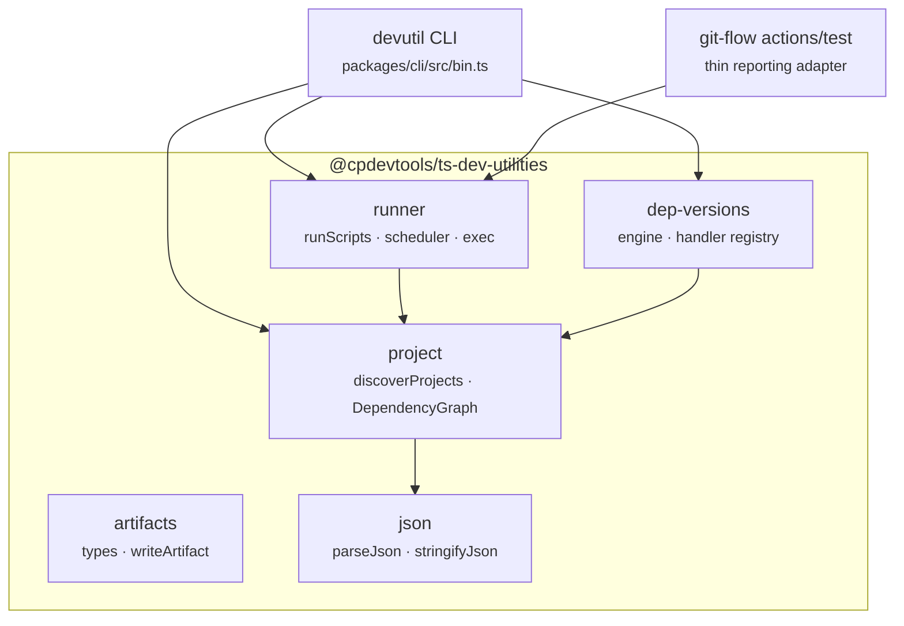

# Architecture

## Shape of the repo

A two-package pnpm workspace. `packages/*` is the only member glob, so the workspace root itself is
not a project.

```
ts-dev-utilities/
├── packages/
│   ├── ts-dev-utilities/        # @cpdevtools/ts-dev-utilities — the library
│   │   └── src/
│   │       ├── project/         # discovery + dependency graph
│   │       ├── runner/          # parallel scheduler + process exec
│   │       ├── dep-versions/    # cross-ecosystem version pinning
│   │       ├── artifacts/       # artifact descriptor types + writer
│   │       ├── json/            # JSONC parse/stringify
│   │       └── index.ts         # globby + change-case re-exports
│   └── cli/                     # @cpdevtools/ts-dev-utilities-cli — the devutil binary
└── .publish/                    # versions.yml · registries.yml · deps.yml
```

## How the modules layer



`artifacts` and `json` are leaves — nothing else in the library depends on them, they exist for
consumers. `runner` is the only module that spawns processes.

## Design principles

These are the constraints the code is actually written to, and they explain most of the shape:

**Generic engine, no pipeline coupling.** The scheduler knows about projects, scripts and a
dependency graph. It knows nothing about releases, artifacts, tags, or GitHub. Anything
GitHub-specific — annotations, step summaries, mode presets — belongs in git-flow's `test` action,
which is a thin adapter over `runScripts`.

**No pass tracking, no change detection.** An earlier design persisted per-project "pass" state as
git tags pushed to origin, with a cleanup workflow to garbage-collect them. It was prone to
concurrency races and stale caches, and was dropped entirely. Every run executes the targeted
scripts across the whole graph.

**Ready-set, not waves.** A project starts the moment all of its workspace dependencies have
passed — not when its whole topological tier finishes. `getTopologicalBatches()` still exists for
batch-style consumers, but the scheduler does not use it.

**Minimal dependencies.** Process execution is plain `node:child_process`; concurrency is a
hand-rolled ready-set loop rather than `p-limit`. The CLI uses a ~20-line argument parser rather
than oclif, deliberately, so that installing the CLI stays cheap.

**Library first, CLI second.** Every CLI command is a thin wrapper over an exported function. If
`devutil` can do it, so can your code.

## Relationship to git-flow

The two repos depend on each other:

- `git-flow` consumes `@cpdevtools/ts-dev-utilities` for the runner (its `test` action) and for the
  artifact types (`build-pack`).
- `ts-dev-utilities` consumes `@cpdevtools/git-flow` and `@cpdevtools/git-flow-cli` as
  devDependencies to release itself.

They therefore **move in lockstep**, which is why `@cpdevtools/ts-dev-utilities` sits in git-flow's
`pnpm-workspace.yaml` `minimumReleaseAgeExclude` — a release has to be consumable the day it
publishes rather than after a cooling-off period. This repo excludes the same three packages for
the same reason:

```yaml
minimumReleaseAgeExclude:
  - '@cpdevtools/git-flow'
  - '@cpdevtools/git-flow-cli'
  - '@cpdevtools/ts-dev-utilities'
```

> Entries are **bare package names, not `name@version`**. pnpm stops at the first entry matching a
> package, so a pinned entry shadows every later one for that same package. A stale pin once sat
> ahead of the current one and silently disabled it, failing CI on a release that was explicitly
> meant to be allowed.

## Build output

`tsup` bundles each subpath as a separate entry, **CJS only**, with `.d.ts` and sourcemaps.
`globby` is inlined (`noExternal`) because it is ESM-only. The CLI is bundled with everything
except `node:` builtins inlined, so `devutil` runs from a single file.
